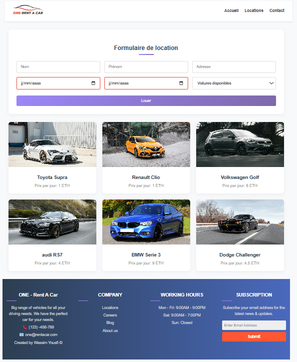

<!DOCTYPE html>
<html lang="fr">
<head>
  <meta charset="UTF-8" />
  <meta name="viewport" content="width=device-width, initial-scale=1.0"/>

</head>
<body>

  <h1>🚗 One-Rente — Application Web3 de Location de Voitures Décentralisée</h1>

  
<strong>One-Rente</strong> est une application Web décentralisée (DApp) de location de voitures, développée avec <strong>React</strong> et <strong>Truffle</strong>. Elle permet d'interagir avec des contrats intelligents sur la blockchain via une interface intuitive.

  <h2>⚙️ Prérequis</h2>
  
Avant de commencer, assure-toi d’avoir installé :

  <ul>
    <li>Node.js</li>
    <li>Truffle</li>
    <li>Ganache</li>
    <li>npm</li>
  </ul>

  <h2>🚀 Installation</h2>
  
<strong>1. Cloner le dépôt :</strong>

  <pre><code>git clone https://github.com/wassimos69/location-de-voiture-.git
  </code></pre>

  
<strong>2. Installer les dépendances :</strong>

  <pre><code>npm install</code></pre>

  <h2>🧪 Lancer un réseau local Ganache</h2>
  
Démarre Ganache avec 10 comptes ayant chacun 100 ETH :

  <pre><code>ganache --port 8545 --chain.chainId 1337 --wallet.totalAccounts 10 --wallet.defaultBalance 100</code></pre>

  <h2>📦 Déployer les contrats intelligents</h2>
  <pre><code>truffle migrate --network ganache</code></pre>

  <h2>☁️ Lancer le serveur d’upload (Node.js)</h2>
  <pre><code>node serveur.js</code></pre>

  <h2>🌐 Lancer l'application React</h2>
  <pre><code>npm start</code></pre>

  <h2>🎉 Profite de l'application !</h2>
   

  

</body>
</html>

